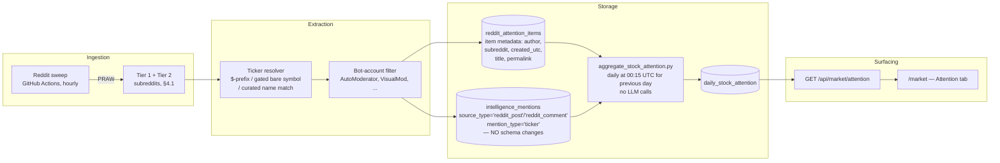

# Stock Attention Tracker — Spec (v2)

Status: **design spec, not yet implemented**. Reddit API credentials (`REDDIT_CLIENT_ID`/`REDDIT_CLIENT_SECRET`/`REDDIT_USER_AGENT`) are set up and verified working (`using_praw: true` against a live `policy-extraction.yml` test run, 2026-07-11). This doc supersedes the informal sketch in CLAUDE.md's roadmap item 2 and reconciles it with the `StockSignal` schema already proposed in [MARKET.md](../MARKET.md)'s "Deferred: Stock Social Signals" section.

**v2 (2026-07-11), revised after design review.** Material changes from v1, each catching a real defect:

1. **v1's drill-down UI could not have rendered.** It stored only Reddit fullnames (`top_source_ids`) but promised a drawer showing thread titles/permalinks/authors — data nothing persisted. v2 adds a compact `reddit_attention_items` table (§3.2).
2. **v1's day bucketing was wrong at the edges.** Aggregating "today" at 23:50 UTC misses the last hour, and bucketing by the mention row's `generated_at` (sweep write time) misfiles any post swept after midnight into the wrong day. v2 buckets by the item's `created_utc` and aggregates the *previous* day shortly after midnight (§6).
3. **v1 required an `ALTER` on the shared `intelligence_mentions` table** (new `author` column). v2 needs **zero changes** to that table — author/subreddit/timestamps live on the new items table and join via `source_id` (§3).
4. **Unbounded growth**: verified in code that `pruneOldRssData` only deletes mentions with `source_type = 'rss_article'` — Reddit mention rows would have accumulated forever. v2 adds explicit retention (§6.3).
5. **v1's ticker false-positive defense (5-word blacklist) was far too weak** — the reviewed reference sites *demonstrate* the failure mode this causes (§5).
6. **v1's scoring formula had a math error and a design smell** (mislabeled half-life; intraday freshness decay inside a daily rollup). Simplified (§6.2).
7. **Expanded subreddit coverage** from 3 to a config-driven two-tier list of 12, with crypto subreddits explicitly excluded from the stock sweep and why (§4.1).

## 1. What this is

A "what's getting talked about" layer for the Market page, in the spirit of ApeWisdom, YoloStocks, and StonkWhisper's Wire (all reviewed live 2026-07-11) — a ranked leaderboard of tickers by social mention volume, paired with the price data `/market` already shows.

**Reference-site techniques we're adopting:**
- Ranked leaderboard with mention count, 24h trend, and drill-down to source threads (all three sites).
- Dedup repeat mentions from the same account in the same day ("Real Mentions" — YoloStocks; without this the leaderboard fills with bot/spam noise). Also exclude known bot accounts (AutoModerator, VisualMod) at sweep time, which YoloStocks calls out explicitly.
- Symbol *and* company-name matching, not just `$TICKER` regex (YoloStocks) — but gated, see §5.
- Multiple ranked views, not just one sort order (StonkWhisper's Chatter Leaders / Momentum Movers / Falling Knives).

**Deliberately not adopting for v1:**
- YoloStocks' "indirect mentions" (crediting every reply in an "AMC will skyrocket" thread as an AMC mention even without the ticker in the text). Real accuracy win, real complexity cost — v2+ candidate (§9).
- True real-time (5-minute) streaming. This repo's cron infrastructure tops out at hourly for GitHub Actions and 10-minute for Vercel crons (§4) — a persistent streaming worker is a different deployment model than anything else in this codebase.
- StonkWhisper's composite 0-100 index and paid-tier signals (options flow, dark pool, insider trades). Out of scope — no data source for those exists here. And a caution, not just an omission: StonkWhisper's own live leaderboard (as scraped during this review) was dominated by 3-5-mention tickers like `V`, `IT`, `ALL`, `NOW`, `YOU`, `OR`, `EU`, `IP` all scored "Full Degen" — exactly what a composite score built on unguarded ticker extraction produces. Their failure mode is this spec's §5 in the wild.

## 2. Architecture



This composes with, rather than duplicates, two things already scoped elsewhere:

- **Roadmap item 1 (watchlists)** queries `intelligence_mentions` by `(mention_type, normalized_value)` via the existing `intelligence_mentions_lookup` index. Writing ticker mentions into that same table means a `mention_type = 'ticker'` watchlist entry works with zero extra code once both land.
- **Roadmap item 3 (entity normalization)**, already implemented — but see §5.3: the full SEC ticker universe deliberately does **not** go into `entity-aliases.json`, because that file is webpack-inlined into the Vercel server bundle and the TS side has no consumer for ticker resolution in v1.

## 3. Data model

### 3.1 `intelligence_mentions` — raw per-item mention layer (existing table, **unchanged**)

| Column | Value for Reddit ticker mentions |
|---|---|
| `source_type` | `'reddit_post'` or `'reddit_comment'` |
| `source_id` | Reddit fullname (e.g. `t3_1abc2de` / `t1_1abc2df`) |
| `mention_type` | `'ticker'` |
| `value` | canonical ticker, e.g. `GME` |
| `normalized_value` | `normalize_mention_value(value)` — same normalization entity aliasing already uses |
| `confidence` | 1.0 `$TICKER`/gated bare symbol; 0.7 curated name match (§5) |

The existing unique constraint `(source_type, source_id, mention_type, normalized_value)` makes sweep writes naturally idempotent: re-sweeping the same post inserts nothing new (`ON CONFLICT DO NOTHING`). One row per (item, ticker) pair.

Author, subreddit, and creation time deliberately do **not** go here — they're item-level facts, not mention-level facts, and adding columns to a shared four-writer table for one consumer is the wrong direction. They live on:

### 3.2 `reddit_attention_items` — item metadata (new table, Python-owned)

Created lazily by the Python side (`neon_feeds.py`'s `_ensure_*_schema()` pattern, like the `documents` table — **not** added to `neon.ts`'s `ensureSchema()`, since the only writer is the sweep script):

```sql
CREATE TABLE IF NOT EXISTS reddit_attention_items (
  source_id   TEXT PRIMARY KEY,      -- Reddit fullname; joins to intelligence_mentions.source_id
  kind        TEXT NOT NULL,         -- 'post' | 'comment'
  subreddit   TEXT NOT NULL,
  author      TEXT NOT NULL,
  title       TEXT NOT NULL DEFAULT '',  -- for comments: the parent submission's title
  permalink   TEXT NOT NULL,
  created_utc TIMESTAMPTZ NOT NULL,  -- the item's Reddit creation time — the day-bucketing key
  score       INTEGER NOT NULL DEFAULT 0,
  swept_at    TIMESTAMPTZ NOT NULL DEFAULT now()
);
CREATE INDEX IF NOT EXISTS reddit_attention_items_created ON reddit_attention_items (created_utc);
```

Only items that produced at least one ticker mention are stored (this table exists to serve the drill-down drawer and the aggregation join, not to archive Reddit). All text columns pass through `_strip_nul_bytes()` — the exact NUL-byte-in-scraped-text failure that broke the Neon documents backfill (see CLAUDE.md, Phase 2) will eventually appear in Reddit text too; reuse the shared sanitizer from `neon_feeds.py` rather than rediscovering that incident.

Upserts are `ON CONFLICT (source_id) DO UPDATE` on `score` and `swept_at` only (score changes as votes come in; identity fields don't).

### 3.3 `daily_stock_attention` — daily rollup (new table)

```sql
CREATE TABLE IF NOT EXISTS daily_stock_attention (
  id              SERIAL PRIMARY KEY,
  attention_date  DATE NOT NULL,              -- UTC day of the items' created_utc (label as UTC in the UI)
  ticker          TEXT NOT NULL,
  mention_count   INTEGER NOT NULL DEFAULT 0, -- COUNT(DISTINCT author): the "Real Mentions" dedup
  source_count    INTEGER NOT NULL DEFAULT 0, -- COUNT(DISTINCT source_id)
  subreddit_count INTEGER NOT NULL DEFAULT 0, -- COUNT(DISTINCT subreddit): cross-community spread
  weighted_score  NUMERIC NOT NULL DEFAULT 0, -- §6.2
  mood            TEXT NOT NULL DEFAULT 'neutral', -- 'bullish' | 'bearish' | 'neutral' | 'mixed'
  top_source_ids  TEXT NOT NULL DEFAULT '[]', -- JSON array, up to 10; drawer joins these to reddit_attention_items
  generated_at    TIMESTAMPTZ NOT NULL DEFAULT now(),
  UNIQUE (attention_date, ticker)
);
CREATE INDEX IF NOT EXISTS daily_stock_attention_date_score ON daily_stock_attention (attention_date, weighted_score DESC);
```

`mention_count = COUNT(DISTINCT author)` (joined through `reddit_attention_items`) *is* the dedup: each account counts once per ticker per day no matter how many times it posts. Known caveat, accepted for v1: Reddit reports deleted accounts as the literal author `[deleted]`, so all deleted-author activity for a ticker collapses to one "mention" — an undercount, and the safer direction to be wrong in.

## 4. Ingestion: sweep mechanics and schedule

### 4.1 Subreddit coverage (expanded in v2; config-driven)

The subreddit list is **configuration, not code** — a JSON list in the sweep script's config (env-overridable), so expanding coverage never requires a code change. Two tiers:

**Tier 1 — on from day one** (the core stock-discussion set; union of what ApeWisdom and YoloStocks both track):

| Subreddit | Why |
|---|---|
| r/wallstreetbets | Highest volume; the primary signal for every reference site |
| r/stocks | High volume, general coverage |
| r/investing | High volume, longer-horizon framing |
| r/StockMarket | General coverage, tracked by both reference sites |
| r/options | Options flow chatter often leads share-price attention |
| r/Daytrading | Short-horizon attention, tracked by ApeWisdom |

**Tier 2 — enable after ~1 week of Tier 1 validation** (niche/velocity boards; more noise, more manipulation risk — exactly where the §5 gating and §8 caveats matter most):

| Subreddit | Why |
|---|---|
| r/pennystocks | Where pump activity shows up first; high false-positive risk |
| r/Shortsqueeze | Squeeze-attention signal (ApeWisdom tracks it) |
| r/SqueezePlays | Same family (ApeWisdom tracks it) |
| r/smallstreetbets | WSB spillover |
| r/ValueInvesting | Slower signal, low noise |
| r/dividends | Slower signal, low noise |

**Deliberately excluded from the stock sweep — crypto subreddits** (r/CryptoCurrency, r/Bitcoin, r/ethereum, r/CryptoMarkets). Crypto symbols collide with legitimate stock tickers, and the reference sites show it live: ApeWisdom's *stock* list (as scraped during this review) contained `TRX` rendered as "Tanzanian Gold Corporation" (it's overwhelmingly TRON in crypto contexts) and `LINK` as "Interlink Electronics" (Chainlink). ApeWisdom itself keeps separate Stocks/Cryptos tabs for this reason. A crypto attention lens is a v2+ feature with its own symbol namespace, not extra subreddits on this sweep.

**Call budget**: per subreddit ≈ 1 listing call + ~20 hot-thread comment fetches = ~21 calls. Tier 1 (6 subs) ≈ 126 calls/sweep; Tier 1+2 (12 subs) ≈ 252 calls/sweep. PRAW self-throttles against Reddit's `X-Ratelimit-*` response headers automatically (confirmed via PRAW's rate-limit docs — no fixed QPM to hardcode; it sleeps and retries within a configurable threshold). At Reddit's nominal free-tier ~100 queries/min, a full Tier 1+2 sweep simply takes ~3 minutes of wall time inside an hourly job — a non-issue.

### 4.2 Cadence

This repo has two cadence patterns — chosen deliberately:

| Pattern | Example | Interval | Mechanism |
|---|---|---|---|
| GitHub Actions connector cron | `bloomberg-public-hourly.yml` | 1 hour (tightest existing GH Actions cadence here) | Python script, `workflow_dispatch` + `schedule:` |
| Vercel cron → Next.js API route | `/api/intel/rss-refresh` | 10 minutes | `vercel.json` `crons[]`, TypeScript |

GitHub's own docs discourage sub-hourly scheduled workflows; nothing in `.github/workflows/` runs faster than hourly. **v1: GitHub Actions, hourly** — reuses the verified PRAW path and matches every other connector's shape. The 10-15-minute upgrade path via Vercel cron requires a second, JS-based Reddit OAuth client (PRAW is Python-only) — new surface area, deferred until hourly proves insufficient (§9).

```yaml
# .github/workflows/reddit-attention-sweep-hourly.yml (new)
on:
  schedule:
    - cron: "5 * * * *"   # offset from bloomberg-public-hourly's :00 to avoid pileup
  workflow_dispatch:
```

### 4.3 Per-sweep work

1. For each configured subreddit: `subreddit.new(limit=100)` + comments on the current top ~20 hot submissions. **Top-level comments only** for v1, and call `submission.comments.replace_more(limit=0)` first — without it, iterating a comment forest triggers extra `MoreComments` API fetches (a classic PRAW footgun that would silently multiply the call budget).
2. Skip items whose author is in the bot blacklist (`AutoModerator`, `VisualMod`, plus a config list — expect to grow it during §Phase 5 validation).
3. Run the ticker resolver (§5) against each submission title+selftext and each comment body.
4. Write `reddit_attention_items` rows (only for items with ≥1 resolved ticker), then `intelligence_mentions` rows, both via batch upsert with `ON CONFLICT` handling in `neon_feeds.py` (a new mentions batch writer — the Python side has never written this table; the TS writer's semantics don't apply since the sweep never rewrites a source's full mention set).
5. **Record source health** via the existing `record_source_health()` machinery (`source_health.py`) under a `reddit_attention_sweep` source key — otherwise sweep failures are invisible to `daily-health-check.yml`, recreating the exact blind spot the July Process Pipeline Review fixed for connectors.

Known coverage limits, accepted for v1: `new(limit=100)` per hour can miss burst periods on WSB (>100 new posts/hour happens on volatile days); comments on new-but-not-yet-hot threads are missed until the thread ranks hot. Both undercount rather than distort.

## 5. Ticker resolution — the #1 quality risk

This is where naive implementations fail, and both reference-site datasets scraped during this review prove it (StonkWhisper: `V`/`IT`/`ALL`/`NOW`/`YOU`/`OR`/`EU`/`IP` as top "signals"; ApeWisdom: `DTE`, `EU`, `CD`, `IT`, `AM`, `OR`, `UP` in its top 100). A 5-word blacklist does not survive contact with WSB text, where `DD` (due diligence → DuPont's old ticker space), `CEO`, `AI` (a real ticker: C3.ai), `PM` (Philip Morris vs. "pre-market"), `FCF` (free cash flow), and `ATH` (all-time high) are everyday vocabulary.

Three-tier resolution, strictest-first:

1. **`$SYMBOL` cashtag** → always counts, confidence 1.0. Unambiguous author intent.
2. **Bare uppercase symbol** (`GME`, `NVDA`) → counts at confidence 1.0 **only if** the symbol is *not* in the ambiguous-symbol list. The ambiguous list is generated, not hand-written: every valid ticker that is also (a) an English word (checked against a standard word list), (b) a common finance/Reddit abbreviation (curated seed: `DD, CEO, CFO, IPO, ATH, OTM, ITM, FD, PT, PM, AH, ER, EOD, EPS, PE, EV, AI, IMO, YOLO, USA, GDP, FBI, SEC, ETF, API, OR, IT, ALL, ARE, FOR, ON, SO, BE, GO, NOW, OPEN, YOU, UP, AM, CD, EU, VT, LOT, RR, OS, SAM, IP`), or (c) ≤2 characters. Ambiguous symbols require the `$` prefix to count at all.
3. **Company-name match** → confidence 0.7, **curated aliases only** (the megacap set already in `entity-aliases.json`, extended incrementally). Never name-match against all ~10k SEC official names — "Apple Inc." is safe to match on "Apple" only because a human decided so; auto-matching official names at scale produces "TARGET"-in-a-sentence-counts-as-TGT bugs.

### 5.3 Where the ticker universe lives (changed from v1)

v1 said to put a `tickers` section in `entity-aliases.json`, consumed by both languages. Wrong on two counts:

- `entity-aliases.json` is **statically imported and webpack-inlined** into the Vercel server bundle (that was a deliberate property of the entity-aliases design). The full SEC `company_tickers.json` universe is ~10k entries — megabytes of dead weight in every server function bundle.
- The TS side has **no consumer**: resolution happens at ingestion time (Python sweep), and the API/UI layers only ever see already-resolved tickers from `daily_stock_attention`.

v2: a separate `ticker_config.json` at the repo root, consumed **only** by Python (`ticker_resolver.py`). Generated by a `build_ticker_config.py` script that fetches SEC's `company_tickers.json` — **with `curl_cffi`, not `requests`**: sec.gov blocks generic HTTP clients via TLS fingerprinting, which is the exact reason this repo's `sec_scraper_free.py` already uses `curl_cffi`. The generator computes the ambiguous-symbol list (word-list check + curated seed) and commits the artifact; regeneration is a manual/quarterly `workflow_dispatch`, not a per-sweep fetch. `entity-aliases.json` remains what it is today — entity aliasing only.

## 6. Aggregation

### 6.1 Timing and day bucketing (fixed from v1)

`aggregate_stock_attention.py` runs at **00:15 UTC and aggregates the previous UTC day**, bucketing by `reddit_attention_items.created_utc` (when the post/comment was actually written) — not by the mention row's `generated_at` (when the sweep happened to store it). v1 had this wrong twice: a 23:50 run misses the day's last hour entirely, and `generated_at` bucketing misfiles anything created late in the day but swept after midnight.

```yaml
# .github/workflows/stock-attention-daily.yml (new)
on:
  schedule:
    - cron: "15 0 * * *"   # aggregate the just-closed UTC day
  workflow_dispatch:
    inputs:
      date:                 # optional YYYY-MM-DD backfill/re-run target
```

Idempotent (`ON CONFLICT (attention_date, ticker) DO UPDATE`), with a `--date` argument so any day can be recomputed after a resolver/blacklist improvement — the same re-runnable-backfill pattern every other one-time script in this repo follows. `attention_date` is a UTC day and the UI labels it as such; a UTC day straddles the US trading session (which ends 20:00–21:00 UTC), and v1 pretending otherwise would just relocate the confusion.

### 6.2 Scoring (simplified from v1)

v1's formula had an intraday freshness-decay term inside a daily rollup — mislabeled as a "6h half-life" (`exp(-t/6)` is a 6-hour *e-folding*, ~4.2h half-life), anchored to an arbitrary aggregation timestamp, and rewarding late-evening posts over morning posts for no principled reason. Freshness decay belongs in a future intraday "what's hot right now" view, not a daily aggregate. v2:

```
weighted_score = mention_count × (1 + 0.15 × min(subreddit_count, 6)) × (1 + 0.05 × min(source_count, 10))
```

Deduped humans talking is the base signal; spread across communities is the strongest amplifier (cross-subreddit attention is harder to fake than volume inside one board); spread across threads is a mild secondary amplifier. All three inputs are stored as their own columns, so the formula can be re-tuned and re-run over history (§6.1's `--date` re-run) without touching raw data.

**`mood`**: CLAUDE.md's Process Pipeline Review already flags this project's *three* disagreeing sentiment systems as an open cleanup item — do not add a fourth. `mood` reuses the same keyword-heuristic pattern as RSS tone (`inferToneLabel` / `_heuristic_enrichment`), computed per-item at sweep time, rolled up as the plurality label per ticker/day (`'mixed'` when no plurality). No LLM calls. Render it de-emphasized in the UI (§7) — keyword tone on WSB's sarcasm-dense text is directional at best.

### 6.3 Retention (missing from v1)

Verified: `pruneOldRssData` (`neon.ts`) deletes `intelligence_mentions` rows **only** for `source_type = 'rss_article'` — Reddit mention rows would grow unbounded. The daily aggregation script ends with a retention sweep: delete `reddit_attention_items` and `intelligence_mentions` rows (`source_type IN ('reddit_post','reddit_comment')`) older than **90 days** (env-overridable, mirroring `RSS_ARTICLE_RETENTION_DAYS`). The `daily_stock_attention` rollups persist indefinitely — they're tiny and they're the product; raw rows only need to outlive the drill-down window and any plausible resolver re-run. This also bounds how long Reddit usernames are retained, which is the right default for republished public data.

## 7. UI — `/market` "Attention" tab

Follows [MARKET.md](../MARKET.md)'s conventions exactly (lazy-fetch on tab activation, polling while active, `{ ok, data, request_id }` envelope):

```
app/market/page.tsx
└── components/market-dashboard.tsx        (add "Attention" to existing tab list)
    └── components/market/attention-tab.tsx
        ├── AttentionLeaderboard            (sortable table, default: weighted_score desc)
        └── AttentionDrawer                 (per-ticker drill-down, row click)
```

```
 #   TICKER   MENTIONS(24h)   Δ 24h    THREADS   SUBS   MOOD        PRICE Δ
 1   SPCX     296             ▲ 41%    18        4      🟢 Bullish  +2.3%
 2   MSFT     247             ▼ 12%    22        6      🔴 Bearish  -0.8%
 3   SPY      224             ▲ 8%     15        5      ◆ Neutral   +0.1%
 ...
[Row click →]  Drawer: top 10 source threads — title, subreddit, author, permalink,
               mood chip — served by joining top_source_ids → reddit_attention_items
               (this join is why §3.2 exists; v1 could not have rendered this panel)
```

`GET /api/market/attention?date=YYYY-MM-DD` (default: latest aggregated day) reads `daily_stock_attention` + the drawer join, and pairs each ticker with a live quote via the existing Yahoo-quote helper where available — the "what moved + what's being talked about" combination that motivated putting this on `/market` at all. Δ 24h compares against the prior day's row.

Required label, rendered directly under the tab header (not just a footer): **"Research context only — not investment advice."**

## 8. Compliance and risk notes

- **Reddit API commercial-use terms**: CLAUDE.md already flags Reddit commercial use as requiring review. A public leaderboard republishing aggregated community data is a heavier use than the existing keyword-search connector — read Reddit's Data API terms specifically for this before it ships publicly.
- **False positives**: §5's gating is the design-level defense; §Phase 5's manual review of a week of live output is the empirical check. Both are required — the reference sites show what shipping without them looks like.
- **Coordinated manipulation**: per-author dedup neutralizes single-account spam; multi-account pumping (especially in Tier 2 subreddits) is out of scope for v1 — flagged, not solved. `subreddit_count` in the score is a partial mitigation (single-board campaigns amplify less).
- **Username retention**: bounded at 90 days by §6.3.

## 9. Deliberately deferred to v2+

- Indirect mentions (thread-title→reply propagation).
- Sub-hourly cadence via Vercel cron + a JS Reddit OAuth client.
- Crypto attention lens (separate symbol namespace; see §4.1's TRX/LINK collision evidence).
- Intraday "hot right now" view (where freshness decay actually belongs).
- Composite single score à la StonkWhisper's Whisper Index — the leaderboard's columns carry the information without collapsing it into one opaque number, and §1 documents why their version is a cautionary tale.

## 10. Implementation timeline

| Phase | Deliverable | Depends on | Size |
|---|---|---|---|
| **0. Credentials** | Reddit API app + secrets | — | **DONE** (verified 2026-07-11) |
| **1. Ticker universe + resolver** | `build_ticker_config.py` (curl_cffi fetch of SEC `company_tickers.json`, ambiguous-list generation) → committed `ticker_config.json`; `ticker_resolver.py` (three-tier resolution, §5); tests: cashtag, gated bare symbol, ambiguous-requires-$, curated name match, blacklist regression fixtures | Phase 0 | Small–Medium |
| **2. Ingestion sweep** | `reddit_attention_items` schema + batch writers in `neon_feeds.py` (with `_strip_nul_bytes`); sweep script (PRAW, bot filter, `replace_more(limit=0)`); `record_source_health` wiring; `reddit-attention-sweep-hourly.yml`; tests with mocked PRAW | Phase 1 | Medium |
| **3. Aggregation + retention** | `aggregate_stock_attention.py` (previous-UTC-day bucketing on `created_utc`, `--date` re-run, §6.2 scoring, mood rollup, 90-day retention sweep) + `stock-attention-daily.yml`; tests incl. the day-boundary case (item created 23:30, swept 00:05) | Phase 2 schema (can develop against mocked rows in parallel) | Medium |
| **4. API + UI** | `GET /api/market/attention` (rollup + drawer join + live-quote pairing); `attention-tab.tsx`; wired into `market-dashboard.tsx` | Phase 3 | Medium |
| **5. Validate + tune** | Tier 1 subreddits live for ~1 week; manual false-positive review of top 50 tickers; grow ambiguous list + bot blacklist; re-run history via `--date` after tuning; then enable Tier 2 | Phase 4 live | Ongoing |
| **6. (Optional) cadence upgrade** | Vercel cron + JS Reddit client, 10-15 min freshness; intraday view | Phase 5 validated | Deferred |

Phases 1-4 are the buildable v1. Phase 5's re-run-history step is why raw inputs and formula stay separated (§6.2) — tuning must never require re-sweeping Reddit.
